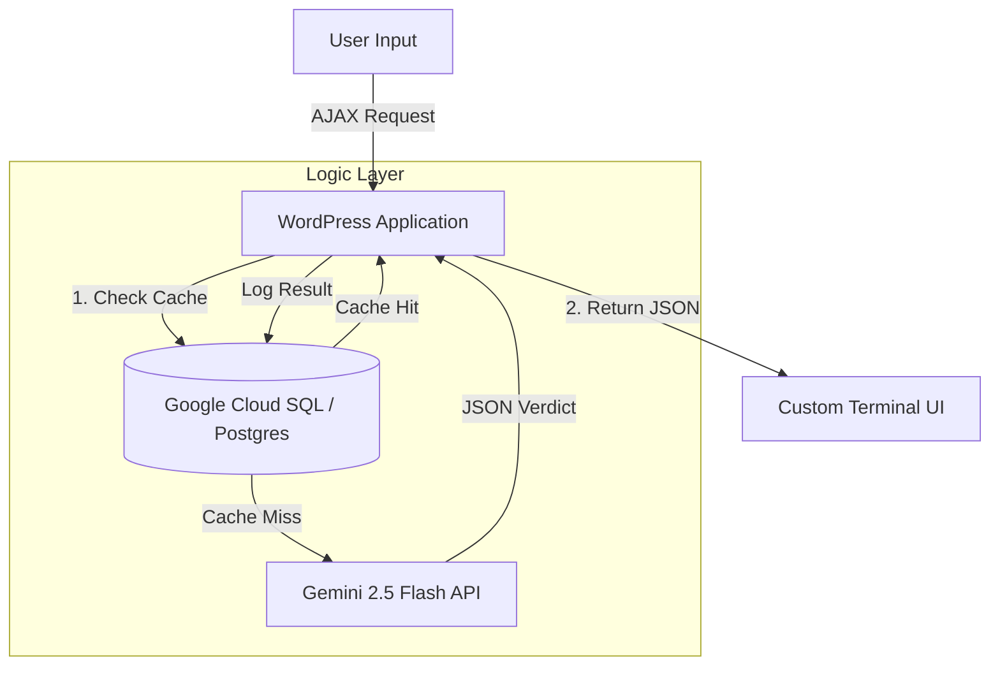

# 🚀 Project: Hybrid AI Verdict Engine & Data Persistence Pipeline

> **Role:** Lead Cloud Architect & Full-Stack Engineer
> 
> **Stack:** PHP 8.4 • PostgreSQL 16 (Google Cloud) • Gemini 2.5 Flash-Lite • WordPress
> 
> **Focus:** Cost Governance, Low-Latency Inference, and Proprietary Data Asset Creation.

---

## 1. Executive Summary
The objective was to build a **Real-Time Speculative Analysis Engine** that classifies user topics based on the "Futures Cone" (Probable, Plausible, Possible).

**The Challenge:**
Standard WordPress databases (MySQL) are ill-suited for storing complex, unstructured AI reasoning logs (JSON). Additionally, relying solely on external APIs (OpenAI/Gemini) for every query is cost-prohibitive and fails to build a defensible data asset.

**The Solution:**
I engineered a **Hybrid Cloud Architecture**:
1.  **The Brain:** Integrating Google's **Gemini 2.5 Flash-Lite** model for high-speed, low-cost inference.
2.  **The Vault:** A dedicated **PostgreSQL** instance on Google Cloud SQL to store "Inflammatory Correlation Index" (ICI) scores using `JSONB` data types.
3.  **The Bridge:** A custom PHP middleware layer that tunnels secure, SSL-encrypted traffic between the application and the cloud database.

---

## 2. Architecture Diagram



---

## 3. Technical Implementation
### Phase 1: Infrastructure (The "Bridge")
To ensure data defensibility, I bypassed the local WordPress MySQL database in favor of a remote PostgreSQL 16 instance.

**Network:** Configured IP Whitelisting and SSL-Mode enforcement.

**Driver:** Patched the host VPS (Ubuntu/CloudPanel) to enable pdo_pgsql drivers for PHP 8.4 via SSH.

**Security:** Credentials stored in system-level configuration (wp-config.php), invisible to the frontend.

### Phase 2: The AI Engine (The "Brain")
Built a custom PHP service to interact with the Gemini 2.5 Flash-Lite API.

System Prompting: Enforced a "Speculative Persona" that strictly outputs valid JSON.

Output Schema:

```JSON

{
  "verdict": "Plausible",
  "ici_score": 85,
  "reasoning": "Analysis of current trajectory...",
  "provocative_question": "What happens when X meets Y?"
}
```

### Phase 3: Persistence Strategy (The "Vault")
Implemented a "Cache-First" logic to reduce API costs and build a proprietary dataset.

**Hash Check:** The system hashes the user topic (SHA-256).

**Lookup:** Checks the Cloud Database for an existing hash.

**Replay:** If found, serves the DB result (0ms latency, $0 cost).

**Inference:** If new, calls Gemini and logs the result via INSERT ... ON CONFLICT DO NOTHING.


---

## 4. Code Highlights (Sanitized)
### The Secure Cloud Connector
A snippet demonstrating PDO connection with SSL enforcement for Cloud SQL.

```PHP

function get_cloud_connection() {
    // Credentials injected via Environment Variables / Config
    $host = 'XX.XX.XX.XX'; // Remote Cloud SQL IP
    $db   = 'research_core_db';
    
    // SSL Mode Required for Security Compliance
    $dsn = "pgsql:host=$host;port=5432;dbname=$db;sslmode=require";

    try {
        return new PDO($dsn, $user, $pass, [
            PDO::ATTR_ERRMODE => PDO::ERRMODE_EXCEPTION,
            PDO::ATTR_TIMEOUT => 5 // Fail fast logic
        ]);
    } catch (PDOException $e) {
        error_log("Cloud Connection Severed: " . $e->getMessage());
        return null;
    }
}
```

## 5. Business Outcomes
**Cost Governance:** Leveraging "Shared Core" Postgres instances and the Gemini "Flash-Lite" model kept operational costs under $10/month while supporting high-volume queries.

**Data Ownership:** Transformed transient user chats into a permanent, queryable Proprietary Dataset (The ICI Index).

**Performance:** Offloaded write-heavy logging to the cloud, preserving the main application server's CPU for user traffic.

© 2025 Teresa Kaylor. Licensed under MIT.
